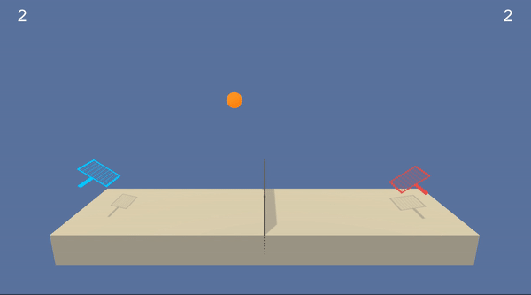

# Unity _Tennis_ Environment
DRL Agent to play Unity Tennis Environment

This is an implementaiton of Udacity Deep Reinforcement Learning Nanodegree's third project. In this project, the two playing agents control rackets to bounce a ball over a net. 



## Environment Details
This is a continuous episodic RL problem and the task is considered `solved` when the agents get an _average score_ of at least +0.5 over 100 consecutive episodes (```over 100 consecutive episodes, after taking the maximum over both agents```).


| Space        | Type | Dim          | Description  |
| ------------- |:------:|:-------:| :-----|
| Observation      | Continuous | [8,] | Position and velocity of the ball and racket |
| Action      | Continuous | [2,]    |   Movement toward (or away from) the net, and jumping  |
| Reward      | Discrete | [1,]     |   +0.1 for every time the agent hits the ball over the net <br> -0.01 when the ball hits the ground  |


## Getting Started
Make sure the environment and the Python interface have compatible versions (Python 3.6). 
```bash
foo@bar:~$ python --version                                                                                      
Python 3.6.5 :: Anaconda, Inc.
```
Install the dependencies or install the project using pip. 
```bash
foo@bar:~$ pip install -r requirements.txt
```
or 
```bash
foo@bar:~$ pip install . -e
```

## Run the Agent
`main.py` is the cli to train/watch the agent. You can find the hyperparameters in `model/config.yaml`.
```bash
foo@bar:~$ python main.py -h
usage: main.py [-h] [--train]

Unity Tennis Agent

optional arguments:
  -h, --help      show this help message and exit
  --train         Train the DDPG agent if used, else load the trained weights
                  and play the game
  --actor_weights PATH  path of .pth file with the trained actor weights
  --critic_weights PATH  path of .pth file with the trained critic weights
```
For further details run `Tennis.ipynb`.
